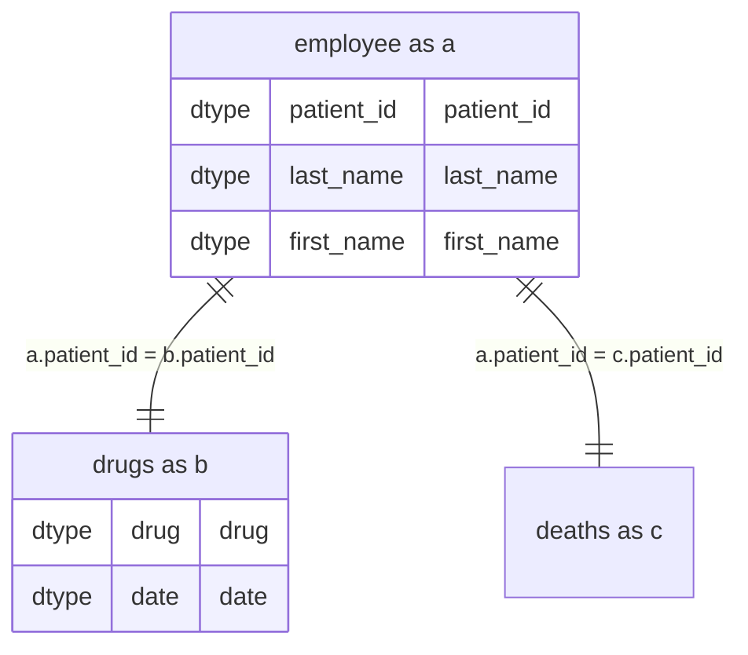

# sql2mermaid
A module to convert an SQL query into a mermaid erDiagram.

# use CLI
## With SQL File
```bash
python -m sql2mermaid --input /my/sqlfile.sql
```
## With query directly in CLI
```bash
python -m sql2mermaid --query "SELECT a.*, b.* FROM table a join table_2 b on a.id = b.id WHERE 1=1;"
```
**NB :** mermaid need a JOIN and a WHERE clause to work correctly. Put a dummy WHERE 1=1 if you don't want to use the WHERE clause.  

# From python

```python
from sql2mermaid import sql2mermaid

# add your SQL query
q = """
SELECT 
  a.patient_id,
  a.last_name,
  a.first_name,
  b.drug,
  b.date
FROM employee a
INNER JOIN drugs b on a.patient_id = b.patient_id
LEFT JOIN deaths c on a.patient_id = c.patient_id
WHERE
c.patient_id is null
ORDER BY b.date"""

# execute function
mermaid = sql2mermaid(q)
print(mermaid)
```
# result


